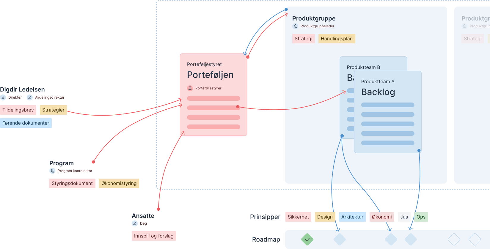

## Flyt i produktutvikling
Denne siden forklarer hvordan produktutvikling i Digdir fungerer og hvordan flyten fra ide eller oppdrag til implementering henger sammen.

## Porteføljen
# Er porteføljen riktig sted for meg?
Porteføljen er de sentrale tiltakene det må settes av midler og ressurser til (utover normal drift) for å realisere. Porteføljen aktiveres også når tiltaket har en tidsramme på minimum 6 måneder og maksimalt 2 år for realisering.

Dersom ideen din vil dra nytte av forankring fra ledelsen eller krever prioritet på tvers av flere team, kan porteføljen hjelpe deg med dette.

Porteføljen gir innspill til Satsningsforslag og Virksomhetsplan på vegne av leverandørrollen i Digdir.

## Porteføljetiltak
# Opprett tiltak i porteføljen
Hvem som helst som ønsker å drive frem endring kan lage et nytt tiltak i porteføljen.
Produktgruppeledere og fagdirektører er representert i porteføljen. De fungerer som rådgivere for porteføljestyrer, fronter tiltak fra egne strategier og ser etter muligheter for samarbeid på tvers.

### [Gå til portefølje](https://baksia.digdir.no/produktutviklingsmodell/portfolio/)

## Oppgavefordeling
# Fordeling av tiltaket
Etter å ha vært gjennom konsept- og planleggingsfasen har du fått beskrevet hvem som er ansvarlig for gjennomføring, hvilke team som må involveres, hvilke ressurser og midler det er behov for med mer.

Tiltaket fordeles deretter til produktgruppen, teamet / teamene eller arbeidsgruppen som skal gjennomføre arbeidet.

## Gjennomføring
# Implementering av tiltaket
Når oppgaven har blitt fordelt ett team lages det egne **epics**  i **bakcklog** til teamet. Disse bruker teamet til å beskrive problemet og løsningen på et overordnet teknisk nivå for så å bryte oppgaven ned i mindre **issues** som de fordeler seg i mellom for å løse oppgaven.

### [Gå til team oversiken](https://baksia.digdir.no/teams/)
